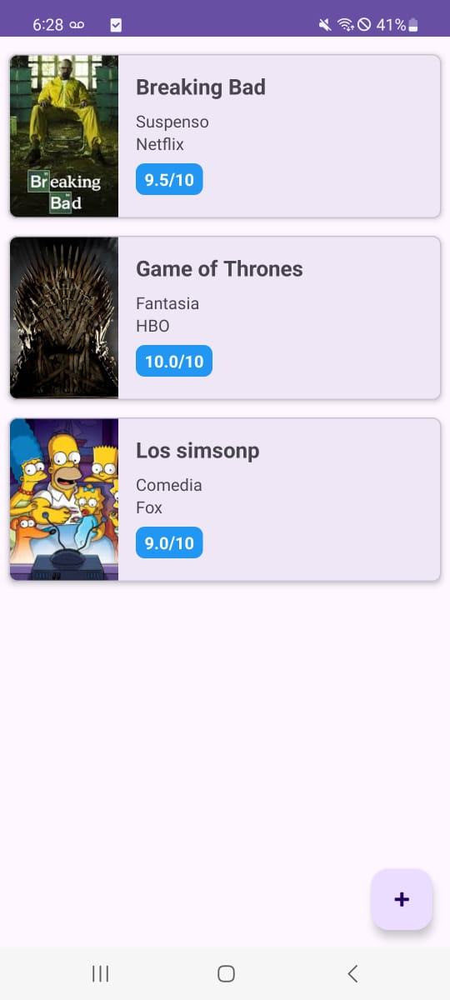
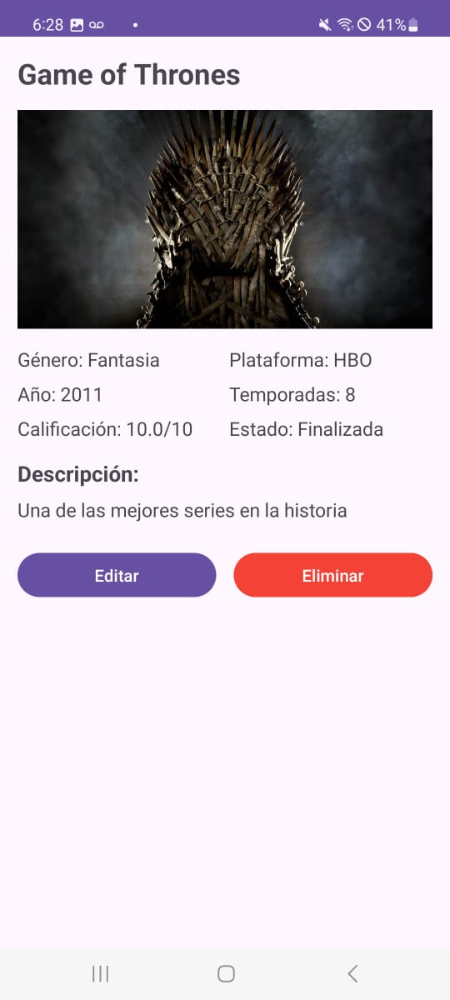
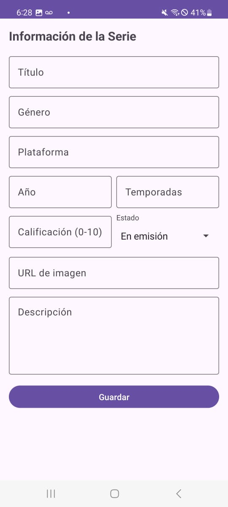

# Series

Aplicación Android para catálogos de series de TV, desarrollado con Kotlin y SQLite.

## Descripción

Esta aplicación permite al usuario crear, visualizar, actualizar y eliminar información sobre sus series , incluyendo detalles como título, género, plataforma, año de estreno, temporadas, calificación y y una descripcion.

## Capturas de pantalla

  
  
  

## Estructura del código

### Clases principales
- `MainActivity`: Pantalla principal con lista de series
- `SerieDetailActivity`: Muestra los detalles completos de una serie
- `SerieForm`: Formulario para crear o editar series
- `SeriesDbHelper`: Gestiona operaciones CRUD con la base de datos SQLite
- `Serie`: Modelo de datos para representar una serie
- `SeriesAdapter`: Para el RecyclerView
- `SerieViewHolder`: ViewHolder para los elementos de la lista

### Base de datos
Se utiliza SQLite para el almacenamiento de datos, con una tabla `series` este incluye:
- id (INTEGER PRIMARY KEY)
- titulo (TEXT)
- genero (TEXT)
- plataforma (TEXT)
- anio_estreno (INTEGER)
- temporadas (INTEGER)
- calificacion (REAL)
- sinopsis (TEXT)
- imagen_url (TEXT)

## Características
- CRUD completo (Crear, Leer, Actualizar, Eliminar)
- Estructura Maestro-Detalle
- Soporte para imágenes mediante URLs

## APK
El APK se encuentra en la carpeta [app-debug.apk](app-debug.apk)

